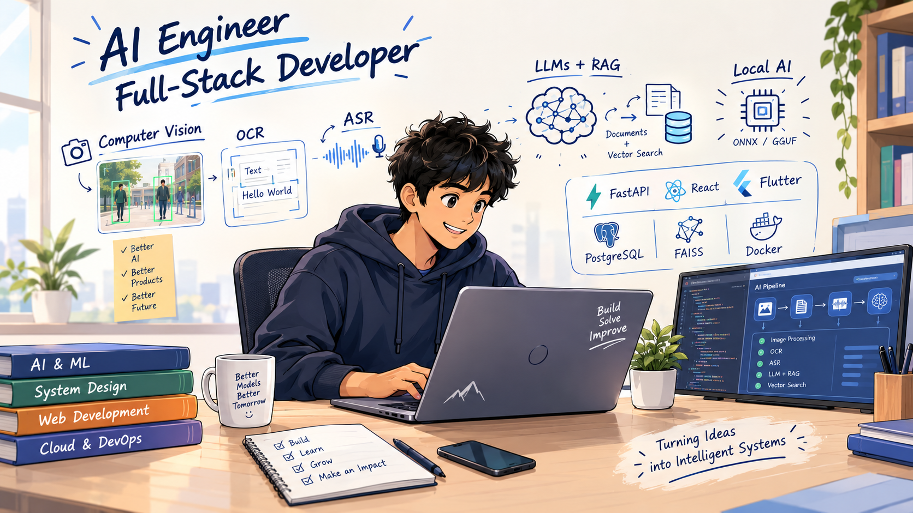

<div align="center">

# 👋 Hi, I'm Kishore R

### AI Engineer · Full-Stack Developer · B.Tech AI & Data Science



<p>
  <a href="mailto:kishorerajaji65@gmail.com">
    
  </a>
  <a href="https://github.com/KishoreR2k7">
    
  </a>
  <a href="https://linkedin.com/in/kishorer2k7">
    
  </a>
</p>

</div>

---

## 🚀 About Me

I'm a **third-year B.Tech student specializing in Artificial Intelligence and Data Science**, focused on building practical, end-to-end AI systems.

My work spans **Computer Vision, OCR, Automatic Speech Recognition (ASR), LLMs, RAG, Agentic AI, embeddings, vector search, and local AI inference**, combined with full-stack application development.

```text
AI Research → Model Integration → Backend APIs → Frontend/Mobile → Deployment
```

---

## 🧠 What I Build

| Area | Focus |
|---|---|
| 👁️ Computer Vision | Face Recognition, OpenCV, visual AI systems |
| 📄 OCR | Document/passage text extraction and processing |
| 🎙️ ASR | Speech-to-text and reading assessment |
| 🤖 Generative AI | LLMs, RAG, Agentic AI, local inference |
| 🔎 Vector Search | Embeddings, FAISS, ChromaDB |
| ⚡ Backend | FastAPI, Node.js |
| 🌐 Frontend | React.js |
| 📱 Mobile | Flutter |
| 🗄️ Data | PostgreSQL, SQLite |
| 🐳 Deployment | Docker |

---

## 🔥 Featured Projects

### 📚 ReadSmart AI — Local AI-Powered Reading Assessment Platform

**Flutter · React.js · Node.js · PaddleOCR · ASR · Local LLM · Docker**

An AI-powered reading assessment platform where students submit reading recordings through a Flutter application for automated performance analysis.

**Key work:**
- Integrated **PaddleOCR** for passage processing.
- Used **ASR** for speech transcription.
- Performed **word-level comparison** to measure reading accuracy.
- Built error analysis for **missed, mismatched, and incorrectly spoken words**.
- Used a **local LLM selectively** for critical evaluation and contextual feedback.
- Developed a **React.js + Node.js admin portal** for passages and assessments.
- Containerized the application using **Docker**.

---

### 👤 Real-Time Face Recognition Attendance System

**Python · FastAPI · React.js · OpenCV · PostgreSQL · FAISS · Google OAuth · JWT**

A real-time AI attendance platform for automated student identification, attendance tracking, and live monitoring.

**Key work:**
- Built automated **face recognition-based attendance**.
- Integrated **multi-camera live monitoring**.
- Used **FAISS vector similarity search** for facial embedding matching.
- Developed **Admin and Student dashboards**.
- Added attendance analytics, reporting, student management, and camera monitoring.
- Implemented authentication and access control using **Google OAuth, JWT, and RBAC**.

---

## 🛠️ Tech Stack

### Programming
<p>


</p>

### AI / ML
<p>


</p>

### Frameworks & Systems
<p>


</p>

### Databases & Vector Stores
<p>


</p>

### Tools
<p>


</p>

---

## 🎓 Education

**Bannari Amman Institute of Technology**  
B.Tech — Artificial Intelligence and Data Science · 2024–2028  
**CGPA: 7.62 / 10**

**KALAIMAHAL Matriculation Higher Secondary School**  
Class XII · 83.83%  
Class X · 86.00%

---

## 🏆 Achievements

- 📜 **NPTEL — Internet of Things (IoT)**
- 🧩 Participated in **2+ hackathons**, developing and presenting AI-driven solutions.
- 🏢 Showcased AI-powered projects at the **Intec Codissia Trade Fair** and received technical feedback from industry professionals.

---

## 📊 GitHub

<div align="center">


</div>

---

## 💡 Current Direction

```text
Building practical AI systems
        ↓
Computer Vision + OCR + ASR
        ↓
LLMs + RAG + Agentic AI
        ↓
Local AI Inference
        ↓
Full-Stack AI Applications
```

> **Build. Learn. Experiment. Deploy. Improve.**

---

<div align="center">

### Let's build intelligent systems that solve real problems. 🚀

</div>
