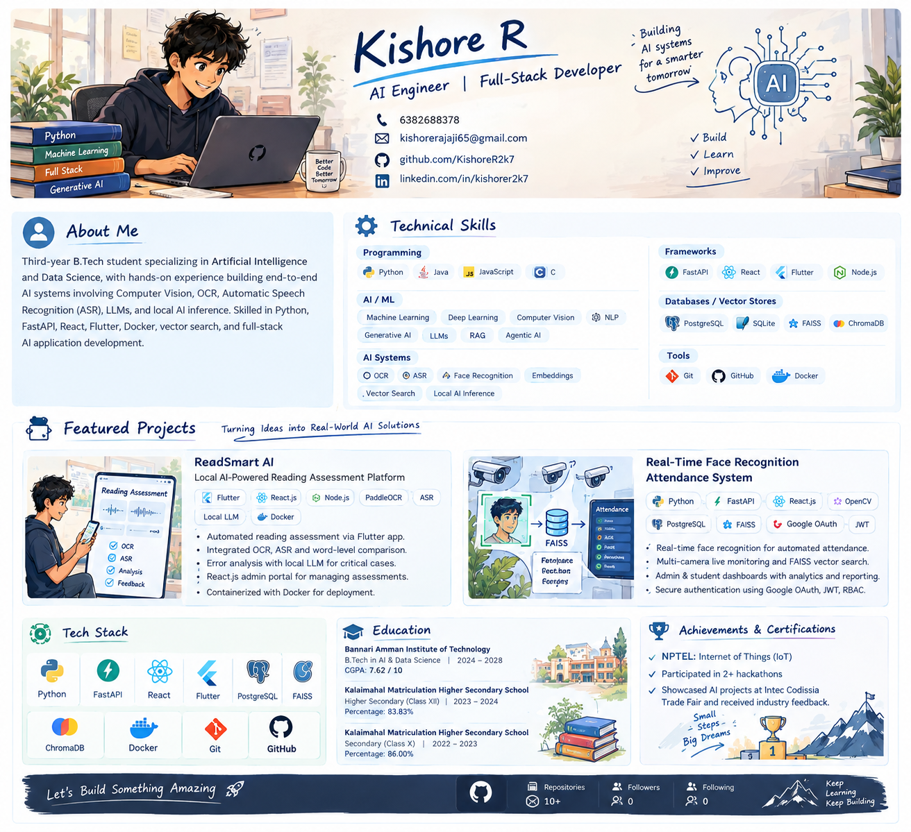
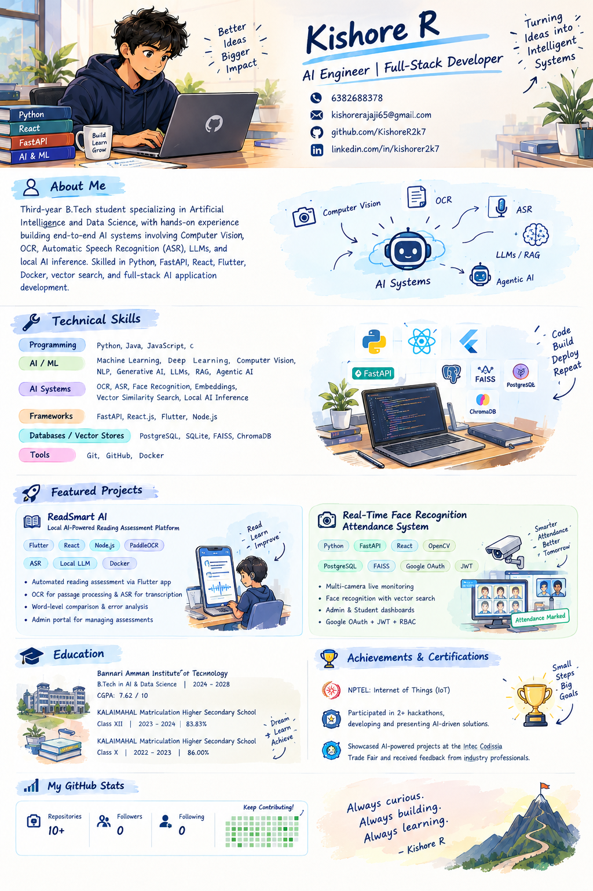
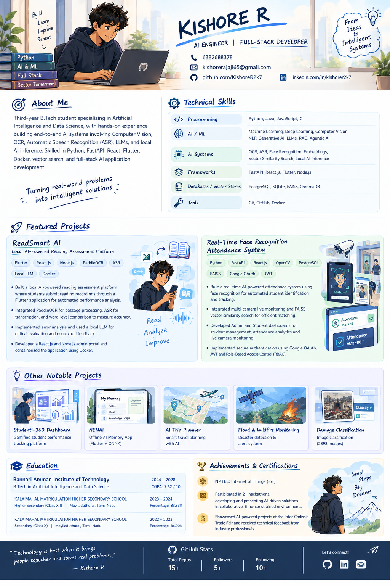

<div align="center">

# 👋 Hi, I'm Kishore R

### AI Engineer | Full-Stack Developer

<p>
  <a href="mailto:kishorerajaji65@gmail.com">Email</a> •
  <a href="https://github.com/KishoreR2k7">GitHub</a> •
  <a href="https://linkedin.com/in/kishorer2k7">LinkedIn</a>
</p>

</div>

---

<div align="center">



</div>

## 🧠 About Me

I'm a **third-year B.Tech student specializing in Artificial Intelligence and Data Science**, focused on building practical, end-to-end AI systems.

My work covers **Computer Vision, OCR, Automatic Speech Recognition (ASR), LLMs, RAG, Agentic AI, embeddings, vector search, and local AI inference**, combined with full-stack application development.

```text
Idea → AI Pipeline → Backend → Web/Mobile → Deployment
```

---

## 🛠️ Technical Skills

**Programming:** Python · Java · JavaScript · C

**AI / ML:** Machine Learning · Deep Learning · Computer Vision · NLP · Generative AI · LLMs · RAG · Agentic AI

**AI Systems:** OCR · ASR · Face Recognition · Embeddings · Vector Similarity Search · Local AI Inference

**Frameworks:** FastAPI · React.js · Flutter · Node.js

**Databases / Vector Stores:** PostgreSQL · SQLite · FAISS · ChromaDB

**Tools:** Git · GitHub · Docker

<div align="center">



</div>

---

# 🚀 Featured Projects

<div align="center">



</div>

### 📚 ReadSmart AI

**Local AI-Powered Reading Assessment Platform**

`Flutter` `React.js` `Node.js` `PaddleOCR` `ASR` `Local LLM` `Docker`

- Automated reading assessment through a Flutter application.
- PaddleOCR for passage processing and ASR for transcription.
- Word-level comparison and error analysis for reading accuracy.
- Local LLM used selectively for critical evaluation and contextual feedback.
- React.js + Node.js admin portal for passages and assessments.
- Docker-based deployment.

### 👤 Real-Time Face Recognition Attendance System

**Real-time AI attendance and monitoring platform**

`Python` `FastAPI` `React.js` `OpenCV` `PostgreSQL` `FAISS` `Google OAuth` `JWT`

- Automated face recognition for student identification and attendance.
- Multi-camera live monitoring with FAISS vector similarity search.
- Admin and Student dashboards for management, analytics and reporting.
- Secure authentication using Google OAuth, JWT and RBAC.

---

## 🎓 Education

**Bannari Amman Institute of Technology**  
B.Tech — Artificial Intelligence and Data Science · 2024–2028  
**CGPA: 7.62 / 10**

**KALAIMAHAL Matriculation Higher Secondary School**  
Class XII · **83.83%** · 2023–2024  
Class X · **86.00%** · 2022–2023

---

## 🏆 Achievements & Certifications

- 📜 **NPTEL — Internet of Things (IoT)**
- 🧩 Participated in **2+ hackathons**, developing and presenting AI-driven solutions.
- 🏢 Showcased AI-powered projects at the **Intec Codissia Trade Fair** and received technical feedback from industry professionals.

---

## 📈 My Journey

```text
Learn
  ↓
Experiment
  ↓
Build AI Systems
  ↓
Solve Real Problems
  ↓
Deploy
  ↓
Improve
```

> **Always curious. Always building. Always learning.**

---

## 📊 GitHub

<div align="center">


</div>

---

<div align="center">

### 🚀 Turning ideas into intelligent systems.

<a href="mailto:kishorerajaji65@gmail.com">Let's connect</a>

</div>
